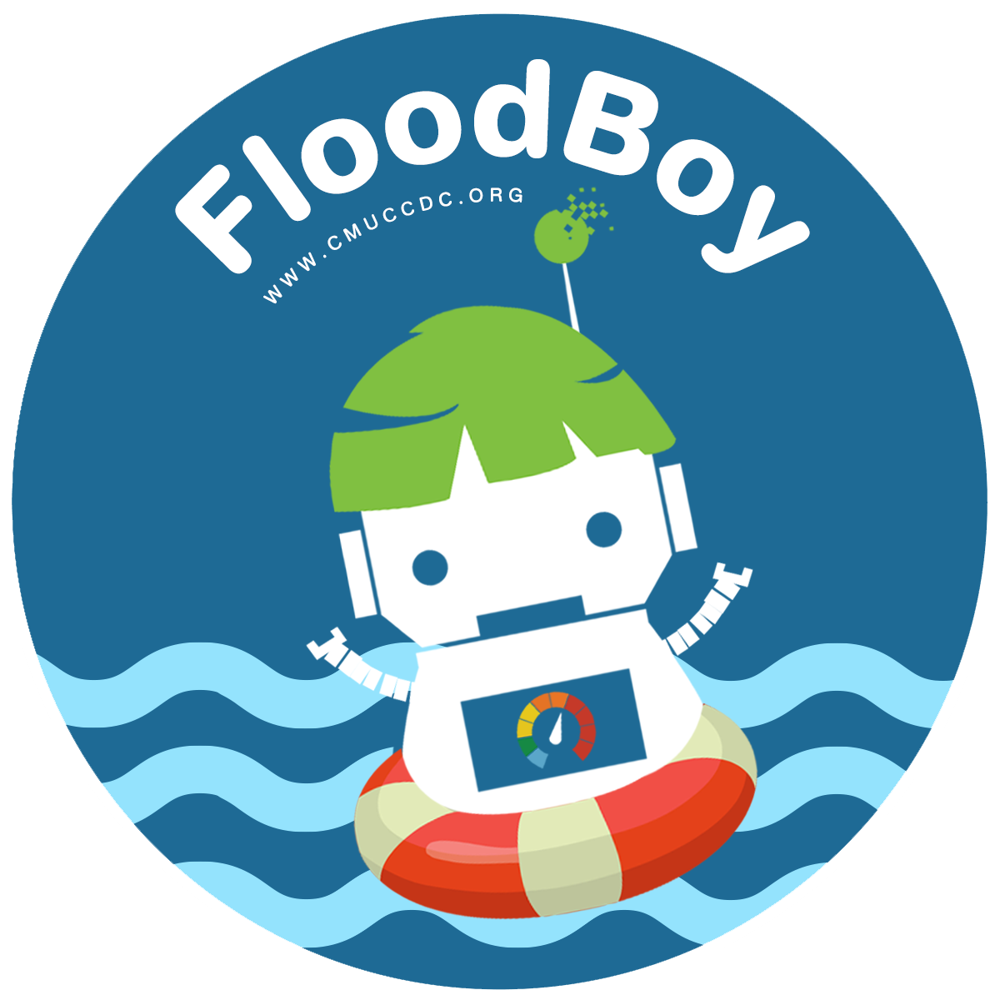

# FloodBoy: IoT-Powered Blockchain

<div align="center">
  
  
  **Real-time flood monitoring system where IoT sensors drive blockchain data for transparent, decentralized flood alerts**
  
  [](https://blockchain.floodboy.online)
  [](https://catlab.io)
  [](https://larislabs.com)
</div>

## 🌊 About FloodBoy

FloodBoy is a cutting-edge flood monitoring system developed for the **CMUCCDC (Chiang Mai University Climate Change Data Center)** initiative. This Web3-enabled platform combines IoT sensors with blockchain technology to create a transparent, tamper-proof record of flood data.

### 🏢 Project Credits

- **Created & Powered by**: [Cat Lab IoT](https://catlab.io) - Leading IoT solutions provider
- **Sponsored by**: [LarisLabs](https://larislabs.com) - Web3 infrastructure and development
- **For**: CMUCCDC - Chiang Mai University Climate Change Data Center

## ✨ Features

- **Real-time Monitoring**: Live flood data from IoT sensors
- **Blockchain Integration**: Immutable data storage on JIBCHAIN L1
- **Multi-chain Support**: Compatible with JIBCHAIN, SiChang, and local Anvil networks
- **Smart Contracts**: Automated sensor data validation and storage
- **Web3 Dashboard**: Modern interface for viewing sensor data and blockchain records
- **Data Export**: CSV export functionality for analysis

## 🚀 Live Deployment

- **Primary URL**: [https://blockchain.floodboy.online](https://blockchain.floodboy.online)
- **Workers URL**: [https://floodboy-astro.laris.workers.dev](https://floodboy-astro.laris.workers.dev)

## 🛠️ Technology Stack

- **Frontend**: Astro + React + Tailwind CSS
- **Blockchain**: Viem + Smart Contracts (Solidity)
- **IoT Integration**: MQTT + Sensor Network
- **Infrastructure**: Cloudflare Workers
- **Networks**: JIBCHAIN L1, SiChang, Anvil

## 📊 Smart Contract Architecture

```
Factory Contract (JIBCHAIN L1): 0x904f1CCDb682f0E7b82387190C0EbF9015152BE7
```

The system uses a factory pattern where:
1. Factory deploys individual sensor stores
2. Each store manages its own sensor data
3. Authorized sensors can submit data
4. All data is timestamped and immutable

## 🔧 Installation

```bash
# Clone the repository
git clone https://github.com/LarisLabs/floodboy-astro.git
cd floodboy-astro

# Install dependencies
pnpm install

# Start development server
pnpm dev

# Build for production
pnpm build
```

## 🌐 Environment Configuration

Create a `.env` file:

```env
# Blockchain RPC URLs
PUBLIC_JIBCHAIN_RPC=https://rpc-l1.jbc.xpool.pw
PUBLIC_SICHANG_RPC=https://sichang-rpc.thaichain.org

# Contract Addresses
PUBLIC_FACTORY_ADDRESS=0x904f1CCDb682f0E7b82387190C0EbF9015152BE7
```

## 📡 IoT Sensor Integration

FloodBoy supports various flood monitoring sensors:

- **Water Level Sensors**: Ultrasonic distance measurement
- **Battery Monitoring**: Voltage tracking for remote installations
- **Installation Height**: Calibration data
- **Water Depth Count**: Flood event tracking

## 🔗 Blockchain Networks

### JIBCHAIN L1 (Production)
- Chain ID: 8899
- RPC: https://rpc-l1.jbc.xpool.pw
- Explorer: https://exp.jibchain.net

### SiChang (Alternative)
- Chain ID: 700011
- RPC: https://sichang-rpc.thaichain.org
- Explorer: https://sichang.thaichain.org

## 🤝 Contributing

We welcome contributions! Please see our contributing guidelines for more details.

## 📄 License

This project is licensed under the MIT License - see the LICENSE file for details.

## 🙏 Acknowledgments

- **Cat Lab IoT** for creating and powering the Web3 infrastructure
- **LarisLabs** for sponsoring the development
- **CMUCCDC** for the vision of climate-aware flood monitoring
- **Chiang Mai University** for supporting climate change research

## 📞 Contact

- **Cat Lab IoT**: [https://catlab.io](https://catlab.io)
- **LarisLabs**: [https://larislabs.com](https://larislabs.com)
- **Project**: [https://blockchain.floodboy.online](https://blockchain.floodboy.online)

---

<div align="center">
  <strong>Beta Version - For Research Purposes Only</strong>
  <br>
  <em>Building a flood-resilient future with IoT and blockchain technology</em>
</div>